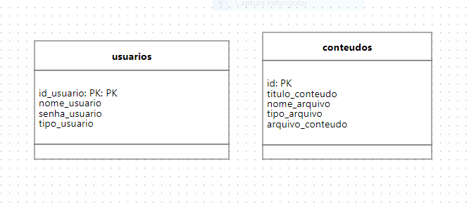
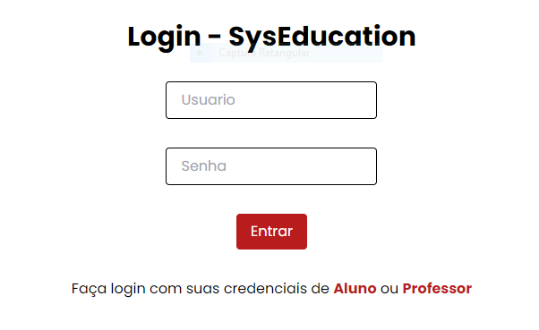
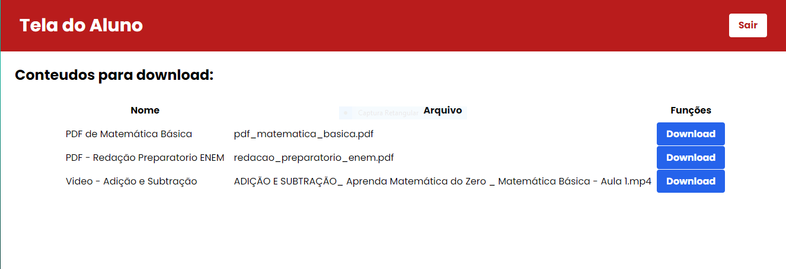
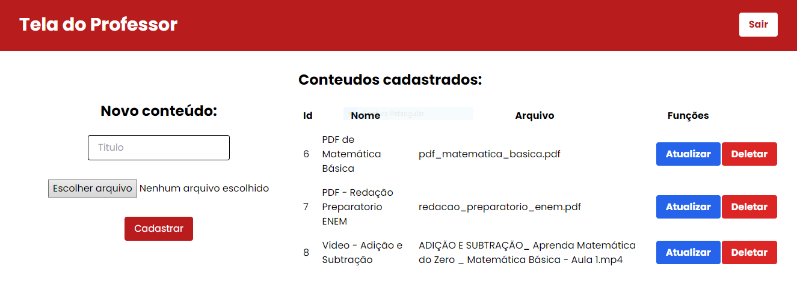

# Trabalho PHP e MySQL 

Este é um aplicativo de gerenciamento de conteúdos educativos, desenvolvido para permitir a interação entre **professores** e **alunos**. O sistema possui um login exclusivo para cada tipo de usuário, onde os professores podem cadastrar e disponibilizar conteúdos para os alunos, que por sua vez, podem acessar e baixar esses arquivos de maneira simples e intuitiva.

## Funcionalidades

### Para Professores:
- **Cadastro de Conteúdos:** Os professores podem cadastrar novos conteúdos educativos (arquivos, links, etc.) para que os alunos possam acessá-los.
- **Gestão de Conteúdos:** Professores têm controle sobre os conteúdos cadastrados, podendo editar ou excluir os arquivos.
  
### Para Alunos:
- **Tela de Login:** Os alunos podem fazer login com suas credenciais para acessar conteúdos exclusivos.
- **Visualização e Download de Conteúdos:** Os alunos têm acesso a uma interface simples onde podem visualizar e baixar os materiais disponibilizados pelos professores.

### Sistema de Login:
- **Autenticação por credenciais:** Cada usuário (professor ou aluno) tem um login e senha próprios.

## Tecnologias Utilizadas

- **Frontend:** HTML5, Tailwind CSS
- **Backend:** PHP
- **Banco de Dados:** MySQL

## Como Rodar o Projeto Localmente

### Requisitos
- Banco de dados configurado (MySQL)

### Modelagem do Banco de Dados

- "arquivo_conteudo" é do tipo longblob.

### Imagens do projeto

Tela de Login

Página do Aluno

 

Página do Professor

### Para usar no login:
-- aluno, aluno123  
-- professor, professor123
